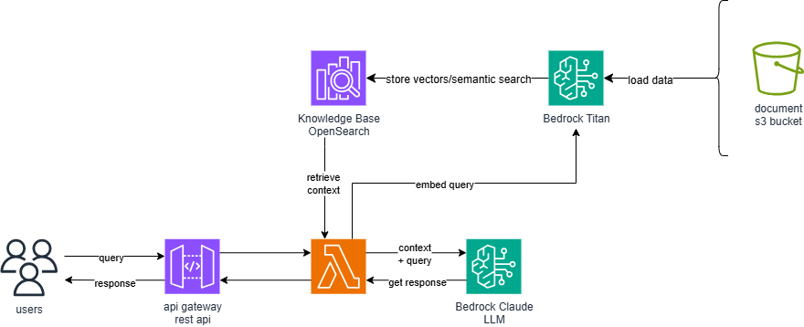

## Training-Final-Assignment
**HR Policy RAG Assistant with AWS CDK and Bedrock**
-
This project deploys a serverless, AI-powered HR assistant using the AWS Cloud Development Kit (CDK). It implements a Retrieval-Augmented Generation (RAG) pipeline to answer questions based on a private collection of HR policy documents.

The architecture leverages:
- **Amazon S3**: To securely store the source HR policy documents.
- **AWS Lambda**: To host the backend to process user queries and implement the RAG retrieval/generation.
- **Amazon API Gateway**: To provide a RESTful API endpoint for users to interact with the assistant.
- **Amazon Bedrock**: 
    - **Knowledge Base**: To create a fully managed vector store for document chunk embeddings.
    - **Titan Text Embeddings V2**: To convert document chunks into vector embeddings (semantic chunking) to prepare for semantic search.
    - **Anthropic Claude 4 Sonnet**: As the Large Language Model (LLM) to generate new, context-aware responses to queries.

This entire infrasturcture is defined and provisioned using the `generative-ai-cdk-constructs` library, which simplifies the process of building GenAI applications on AWS.

**Architecture**:



## Prerequisites
Before you begin, ensure you have the following installed and configurated:
1. **AWS Account and CLI**: An active AWS account and the AWS CLI installed and configured with your credentials.
2. **Python**: Python 3.12 or later.
3. **Node.js and AWS CDK**: The AWS CDK Toolkit requires Node.js.
    - Install Node.js.
    - Install the AWS CDK Toolkit globally by running:
    `npm install -g aws-cdk`
4. **Docker Desktop**: The Docker Desktop **MUST** be running on your local machine before you proceed with the deployment. The `generative-ai-cdk-constructs` library uses Docker to build assets required for the Bedrock Knowledge Base.

## Deployment Steps
1. **Project Setup**

    First, set up your local environment.
    1. Clone the repository:

        ```
        git clone <your-repository-url>
        cd <your-repository-directory>
        ```
    2. Create and activate a Python virtual environment. This isolates the project's dependencies.
        - On Windows:
            ```
            python -m venv llms
            llms\Scripts\activate
            ```
        - On macOS/Linux:
            ```
            python3 -m venv llms
            source llms/bin/activate
            ```
    3. Install the required Python dependencies:
        ```
        python -m pip install --upgrade pip
        pip install -r requirements.txt
        ```
2. **AWS CDK Deployment**

    Now you can deploy the stack to your AWS account.
    1. Bootstrap your AWS environment (only required the first time you use CDK in an account/region):
        ```
        cdk bootstrap
        ```
    2. Synthesize and deploy the CDK stack:
        ```
        cdk deploy
        ```
    3. Upload Documents and Sync Knowledge Base
        After deployment is complete, add your documents to the S3 bucket and sync the Knowledge Base (make sure to sync every time the bucket is updated).
        1. Find your S3 bucket (e.g., `pyrestapistack-hrdocsbucket-xxxx`)
        2. Upload your HR documents to this S3 bucket. You can upload `.pdf`, `.docx`, `.md`, `.txt`, or `.html` files.
        3. Sync the Knowledge Base:
            - Navigate to the Amazon Bedrock console.
            - In the sidebar, select Knowledge bases.
            - Click on the knowledge base created by the stack (e.g., `PyRestApiStack-HRKnowledgeBase-xxxx`).
            - Click the Sync button. This starts the process of ingesting, chunking, and vectorizing your documents.
## How to Use the API
Once the deployment is finished and the Knowledge Base is synced, the CDK will output the API Gateway endpoint URL. You can use this URL to send queries to your HR assistant.

You can use any API client like  `curl` or Postman to send a `POST` request.

Or you can use the built in test file `test/test_deployment.py`.

Just run: 
```
python test/test_deployment.py
```
to see the HR assistant produce three responses to three queries inputted into the RAG pipeline.

In addition, there are two UIs available to deploy and use as an interactive way to use the HR assistant.

For the Gradio web app interface, imply run:
```
python ui/gradio_ui.py
```

For the Streamlit web app interface, run: 
```
streamlit run ui/streamlit_ui.py
```
